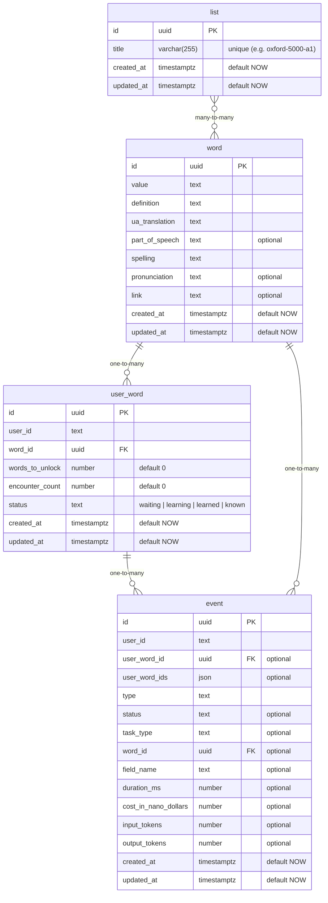

# Database Design

```mermaid
erDiagram
    word {
        id uuid PK
        value text
        definition text
        ua_translation text
        part_of_speech text "optional"
        spelling text
        pronunciation text "optional"
        link text "optional"
        created_at timestamptz "default NOW"
        updated_at timestamptz "default NOW"
    }

    list {
        id uuid PK
        title varchar(255) "unique (e.g. oxford-5000-a1)"
        created_at timestamptz "default NOW"
        updated_at timestamptz "default NOW"
    }

    user_word {
        id uuid PK
        user_id text
        word_id uuid FK
        words_to_unlock number "default 0"
        encounter_count number "default 0"
        status text "waiting | learning | learned | known"
        created_at timestamptz "default NOW"
        updated_at timestamptz "default NOW"
    }

    event {
        id uuid PK
        user_id text
        user_word_id uuid FK "optional"
        user_word_ids json "optional"
        type text
        status text "optional"
        task_type text "optional"
        word_id uuid FK "optional"
        field_name text "optional"
        duration_ms number "optional"
        cost_in_nano_dollars number "optional"
        input_tokens number "optional"
        output_tokens number "optional"
        created_at timestamptz "default NOW"
        updated_at timestamptz "default NOW"
    }

    list }o--o{ word : "many-to-many"
    word ||--o{ user_word : "one-to-many"
    user_word ||--o{ event : "one-to-many"
    word ||--o{ event : "one-to-many"
```
