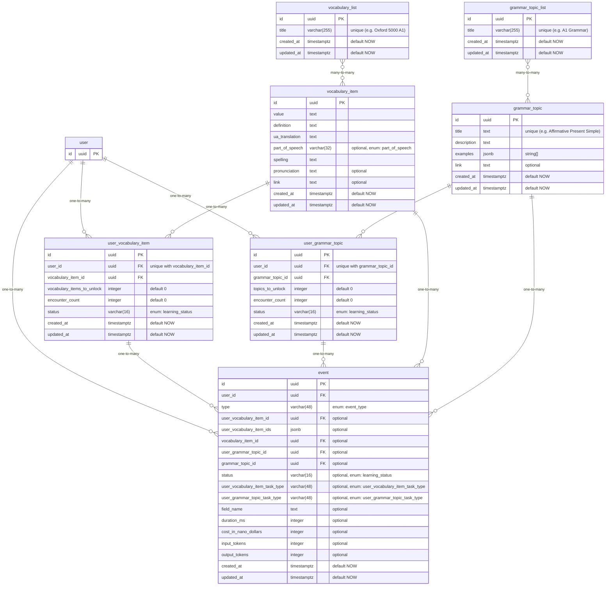

# Database Design

## Enums

### event_type

- user_vocabulary_item_discovered
- user_vocabulary_item_task_failed
- user_vocabulary_item_task_showcase_viewed
- user_vocabulary_item_task_passed
- user_vocabulary_item_task_retry_passed
- user_vocabulary_item_task_hint_used
- user_vocabulary_item_task_generated
- user_vocabulary_item_moved_to_next_step
- vocabulary_item_updated
- user_grammar_topic_discovered
- user_grammar_topic_task_failed
- user_grammar_topic_task_showcase_viewed
- user_grammar_topic_task_passed
- user_grammar_topic_task_retry_passed
- user_grammar_topic_task_hint_used
- user_grammar_topic_task_generated
- user_grammar_topic_moved_to_next_step
- grammar_topic_updated

### user_vocabulary_item_task_type

- showcase
- vocabulary_item_to_definition
- definition_to_vocabulary_item
- vocabulary_item_to_translation
- translation_to_vocabulary_item
- pronunciation_to_vocabulary_item
- translate_english_sentence
- translate_ukrainian_sentence

### user_grammar_topic_task_type

> TODO: define specific task types for grammar topics

- showcase

### learning_status

- waiting
- learning
- learned
- known

### part_of_speech

- adjective
- adverb
- auxiliary verb
- conjunction
- definite article
- determiner
- exclamation
- indefinite article
- infinitive marker
- linking verb
- modal verb
- noun
- number
- ordinal number
- preposition
- pronoun
- verb
