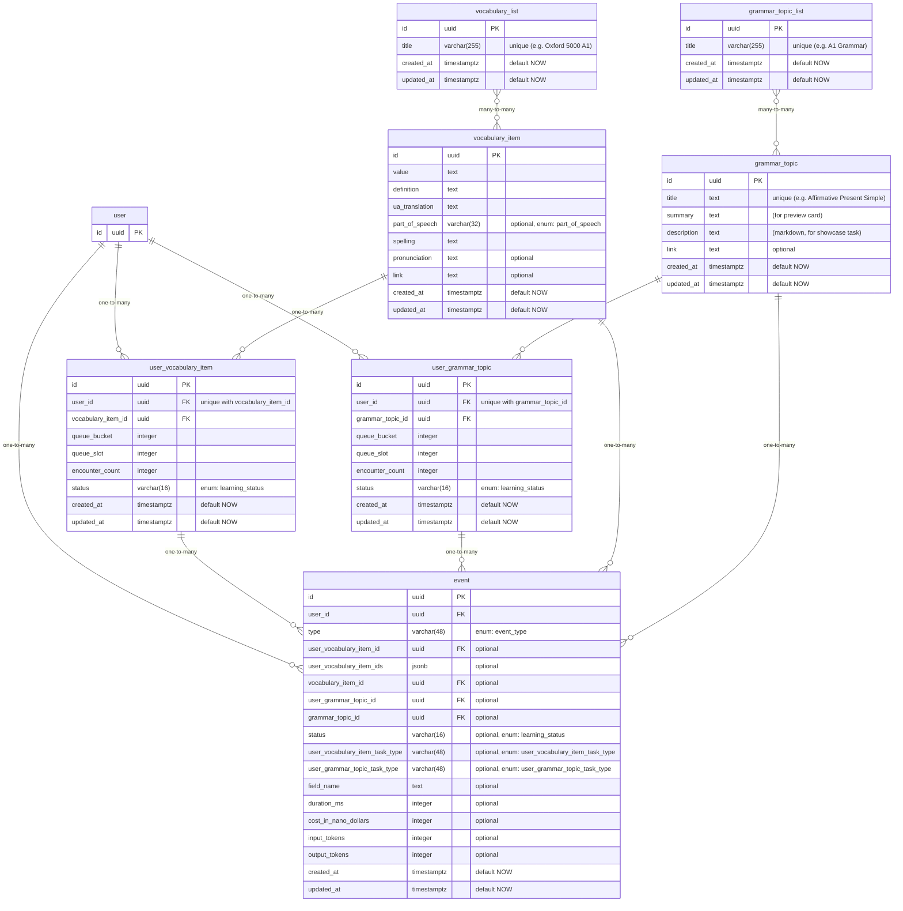

# Database Design



> **Note:** Many-to-many arrows imply a junction table (e.g. `vocabulary_list_vocabulary_item`, `grammar_topic_list_grammar_topic`).

## Enums

### event_type

- user-vocabulary-item-discovered
- user-vocabulary-item-task-failed
- user-vocabulary-item-task-showcase-viewed
- user-vocabulary-item-task-passed
- user-vocabulary-item-task-retry-passed
- user-vocabulary-item-task-hint-used
- user-vocabulary-item-task-generated
- user-vocabulary-item-moved-to-next-step
- vocabulary-item-updated
- user-grammar-topic-discovered
- user-grammar-topic-task-failed
- user-grammar-topic-task-showcase-viewed
- user-grammar-topic-task-passed
- user-grammar-topic-task-retry-passed
- user-grammar-topic-task-hint-used
- user-grammar-topic-task-generated
- user-grammar-topic-moved-to-next-step
- grammar-topic-updated

### user_vocabulary_item_task_type

- showcase
- vocabulary-item-to-definition
- definition-to-vocabulary-item
- vocabulary-item-to-translation
- translation-to-vocabulary-item
- pronunciation-to-vocabulary-item
- translate-english-sentence
- translate-ukrainian-sentence

### user_grammar_topic_task_type

- showcase
- make-sentence
- translate-to-english
- fill-in-the-blank
- find-mistake

### learning_status

- waiting
- learning
- learned
- known

### part_of_speech

- adjective
- adverb
- auxiliary-verb
- conjunction
- definite-article
- determiner
- exclamation
- indefinite-article
- infinitive-marker
- linking-verb
- modal-verb
- noun
- number
- ordinal-number
- preposition
- pronoun
- verb

## Learning queue pattern

Both vocabulary items and grammar topics use the **[new, old, old]** (1:2) queue pattern with `E = 3` encounters per item and `S = 3` spacing (`REVIEW_AFTER_VALUE`).

Each item needs `R = E - 1 = 2` reviews. The 1:2 ratio provides exactly 2 old slots per new item, matching review demand at steady state.

### Comparison: [new, old, old] vs [new, old]

|                       | [new, old, old] (1:2) | [new, old] (1:1)  |
| --------------------- | --------------------- | ----------------- |
| **Formulas**          |                       |                   |
| Bank at end           | `R × S`               | `≈ N / 2`         |
| Review-only tail      | `S × R(R+1) / 2`      | `(R-1) × N + S`   |
| Tail %                | `≈ 0%` for large N    | `≈ 33%` always    |
| **Words (N = 5000)**  |                       |                   |
| Bank                  | 6                     | ~2500             |
| Tail                  | 9 slots (0.06%)       | ~5003 slots (33%) |
| **Grammar (N ≈ 150)** |                       |                   |
| Bank                  | 6                     | ~75               |
| Tail                  | 9 slots (2%)          | ~153 slots (33%)  |

With 1:1 half the items remain in the bank when new content runs out, creating a 33% review-only tail. With 1:2 the tail is fixed at 9 slots regardless of content size.

### Queue implementation (queue_bucket / queue_slot)

The queue is physically ordered by `(queue_bucket, queue_slot)` pairs. Each queue_bucket has 3 queue_slots following the **[new, old, old]** pattern, where **new** = `encounter_count = 0` and **old** = `encounter_count > 0`:

| queue_bucket | queue_slot | Type |
| ------------ | ---------- | ---- |
| 1            | 1          | new  |
| 1            | 2          | old  |
| 1            | 3          | old  |
| 2            | 1          | new  |
| 2            | 2          | old  |
| 2            | 3          | old  |

#### Placement rules

**New item:** find the current max new position (`encounter_count = 0`, `ORDER BY queue_bucket DESC, queue_slot DESC`) → place at `(max_queue_bucket + 1, 1)`.

**Old item:** find the current max old position `(queue_bucket, queue_slot)` (`encounter_count > 0`, `ORDER BY queue_bucket DESC, queue_slot DESC`):

- If it fits in the current bucket (`queue_slot < 3`): place at `(queue_bucket, queue_slot + 1)`
- Otherwise: place at `(queue_bucket + 1, 2)` (slot resets: `3 - 2 + 1 = 2`)

#### Initial old offset

- **Vocabulary:** first old item is inserted at **bucket 13**, giving two full sessions (12 new items) before reviews begin (new#1, new#2, ..., new#12, new#13, old#1, old#2, new#14, old#3, old#4).
- **Grammar:** first old item is inserted at **bucket 2**, giving two new topics before reviews begin (new#1, new#2, old#1).

#### Auto-balancing

The queue_bucket/queue_slot scheme is self-balancing after items are moved to the next step (popped from the queue) from arbitrary positions. `ORDER BY queue_bucket, queue_slot` always returns items in the correct [new, old, old] sequence regardless of gaps.

#### Indexes

```sql
-- Read queue (fetch next items)
CREATE INDEX queue_items_next_idx
  ON queue_items (user_id, queue_bucket, queue_slot);

-- Find max position for inserting old/new items
CREATE INDEX queue_items_encounter_bucket_idx
  ON queue_items (user_id, encounter_count, queue_bucket DESC, queue_slot DESC);
```

#### Queries

```sql
-- Fetch next session (6 items)
SELECT *
FROM queue_items
WHERE user_id = ?
ORDER BY queue_bucket, queue_slot
LIMIT 6;

-- Find max old position (for placing next review)
SELECT *
FROM queue_items
WHERE user_id = ?
  AND encounter_count > 0
ORDER BY queue_bucket DESC, queue_slot DESC
LIMIT 1;

-- Find max new position (for placing next new item)
SELECT *
FROM queue_items
WHERE user_id = ?
  AND encounter_count = 0
ORDER BY queue_bucket DESC, queue_slot DESC
LIMIT 1;
```

## Grammar tasks\*

All tasks are BE-generated (LLM). When user starts reading the showcase article, the client requests task generation in the background.

Each session generates 4 tasks per grammar topic. Topics follow the [new, old, old] queue pattern.

### showcase

Read the grammar topic markdown article (description field).

### make_sentence

Arrange shuffled word tiles into a correct sentence.

```
[ to ] [ doesn't ] [ school ] [ She ] [ go ]
→ [ She ] [ doesn't ] [ go ] [ to ] [ school ]
```

### translate_to_english

See a Ukrainian sentence, build the English translation from shuffled word tiles.

```
"Вона не ходить до школи"
[ to ] [ doesn't ] [ school ] [ She ] [ go ]
→ [ She ] [ doesn't ] [ go ] [ to ] [ school ]
```

### fill_in_the_blank

Pick words from a shuffled word bank to fill one or more blanks. Word bank includes correct words + distractors.

```
If I ___ you, I ___ do this.
Word bank (shuffled): [ would ] [ was ] [ will ] [ were ] [ am ]
→ [ were ] , [ would ]
```

### find_mistake

Tap the word that contains a grammar mistake.

```
[ She ] [ don't ] [ go ] [ to ] [ school ]
→ tap [ don't ] (should be "doesn't")
```
