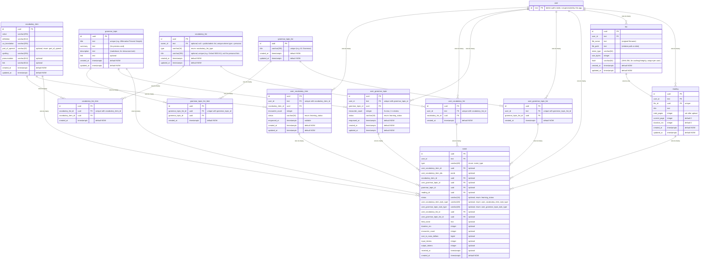

# Database Design Plan

> **Abstract design.** This document captures the major structural decisions — the learning algorithm, queue mechanics, session logic — not a precise implementation spec. Minor details (missing `created_at` on some tables, `id` presence, exact index definitions) may be imprecise or incomplete and are expected to change during implementation. Don't get hung up on them here.


```mermaid
erDiagram
    user {
        id text PK "better-auth's table, not generated by this app"
    }

    vocabulary_item {
        id uuid PK
        value varchar(255)
        definition varchar(512)
        ua_translation varchar(255)
        part_of_speech varchar(32) "optional, enum: part_of_speech"
        spelling varchar(255)
        pronunciation varchar(512) "optional"
        link varchar(512) "optional"
        created_at timestamptz "default NOW"
        updated_at timestamptz "default NOW"
    }

    grammar_topic {
        id uuid PK
        title text "unique (e.g. Affirmative Present Simple)"
        summary text "(for preview card)"
        description text "(markdown, for showcase task)"
        link text "optional"
        created_at timestamptz "default NOW"
        updated_at timestamptz "default NOW"
    }

    vocabulary_list {
        id uuid PK
        owner_id text FK "optional; null = public/admin list; unique where type = personal"
        type varchar(16) "enum: vocabulary_list_type"
        title varchar(255) "optional, unique (e.g. Oxford 5000 A1); null for personal lists"
        created_at timestamptz "default NOW"
        updated_at timestamptz "default NOW"
    }

    grammar_topic_list {
        id uuid PK
        title varchar(255) "unique (e.g. A1 Grammar)"
        created_at timestamptz "default NOW"
        updated_at timestamptz "default NOW"
    }

    grammar_topic_list_item {
        id uuid PK
        grammar_topic_list_id uuid FK "unique with grammar_topic_id"
        grammar_topic_id uuid FK
        created_at timestamptz "default NOW"
    }

    user_grammar_topic_list {
        id uuid PK
        user_id text FK "unique with grammar_topic_list_id"
        grammar_topic_list_id uuid FK
        created_at timestamptz "default NOW"
    }

    vocabulary_list_item {
        id uuid PK
        vocabulary_list_id uuid FK "unique with vocabulary_item_id"
        vocabulary_item_id uuid FK
        created_at timestamptz "default NOW"
    }

    user_vocabulary_item {
        id uuid PK
        user_id text FK "unique with vocabulary_item_id"
        vocabulary_item_id uuid FK
        encounter_count integer
        status varchar(16) "enum: learning_status"
        enqueued_at timestamptz "nullable"
        created_at timestamptz "default NOW"
        updated_at timestamptz "default NOW"
    }

    user_vocabulary_list {
        id uuid PK
        user_id text FK "unique with vocabulary_list_id"
        vocabulary_list_id uuid FK
        created_at timestamptz "default NOW"
    }

    user_grammar_topic {
        id uuid PK
        user_id text FK "unique with grammar_topic_id"
        grammar_topic_id uuid FK
        encounter_count integer "0=new, 1+=review"
        status varchar(16) "enum: learning_status"
        enqueued_at timestamptz "default NOW"
        created_at timestamptz "default NOW"
        updated_at timestamptz "default NOW"
    }

    file {
        id uuid PK
        user_id text FK
        file_name text "(original filename)"
        file_path text "(relative path on disk)"
        mime_type varchar(64)
        size_bytes integer
        hash varchar(64) "(SHA-256, for caching/integrity, unique per user)"
        created_at timestamptz "default NOW"
        updated_at timestamptz "default NOW"
    }

    reading {
        id uuid PK
        user_id text FK
        file_id uuid FK "unique"
        title text
        total_pages integer "set after upload"
        current_page integer "default 0"
        duration_ms integer "default 0"
        created_at timestamptz "default NOW"
        updated_at timestamptz "default NOW"
    }

    event {
        id uuid PK
        user_id text FK
        type varchar(48) "enum: event_type"
        user_vocabulary_item_id uuid FK "optional"
        user_vocabulary_item_ids jsonb "optional"
        vocabulary_item_id uuid FK "optional"
        user_grammar_topic_id uuid FK "optional"
        grammar_topic_id uuid FK "optional"
        reading_id uuid FK "optional"
        status varchar(16) "optional, enum: learning_status"
        user_vocabulary_item_task_type varchar(48) "optional, enum: user_vocabulary_item_task_type"
        user_grammar_topic_task_type varchar(48) "optional, enum: user_grammar_topic_task_type"
        user_vocabulary_list_id uuid FK "optional"
        user_grammar_topic_list_id uuid FK "optional"
        field_name text "optional"
        duration_ms integer "optional"
        encounter_count integer "optional"
        cost_in_nano_dollars bigint "optional"
        input_tokens integer "optional"
        output_tokens integer "optional"
        reverted_at timestamptz "optional"
        created_at timestamptz "default NOW"
    }

    user ||--o{ user_vocabulary_item : "one-to-many"
    user ||--o{ user_vocabulary_list : "one-to-many"
    user ||--o{ user_grammar_topic : "one-to-many"
    user ||--o{ user_grammar_topic_list : "one-to-many"
    user ||--o{ event : "one-to-many"
    vocabulary_list ||--o{ vocabulary_list_item : "one-to-many"
    vocabulary_list ||--o{ user_vocabulary_list : "one-to-many"
    vocabulary_item ||--o{ vocabulary_list_item : "one-to-many"
    grammar_topic_list ||--o{ grammar_topic_list_item : "one-to-many"
    grammar_topic ||--o{ grammar_topic_list_item : "one-to-many"
    grammar_topic_list ||--o{ user_grammar_topic_list : "one-to-many"
    user_vocabulary_list ||--o{ event : "one-to-many"
    user_grammar_topic_list ||--o{ event : "one-to-many"
    vocabulary_item ||--o{ user_vocabulary_item : "one-to-many"
    grammar_topic ||--o{ user_grammar_topic : "one-to-many"
    user_vocabulary_item ||--o{ event : "one-to-many"
    user_grammar_topic ||--o{ event : "one-to-many"
    vocabulary_item ||--o{ event : "one-to-many"
    grammar_topic ||--o{ event : "one-to-many"
    user ||--o{ file : "one-to-many"
    user ||--o{ reading : "one-to-many"
    file ||--|| reading : "one-to-one"
    reading ||--o{ event : "one-to-many"
```

## Enums

### event_type

- user-vocabulary-item-discovered
- user-vocabulary-item-discovery-undone
- user-vocabulary-item-task-failed
- user-vocabulary-item-task-showcase-viewed
- user-vocabulary-item-task-passed
- user-vocabulary-item-task-retry-passed
- user-vocabulary-item-task-hint-used
- user-vocabulary-item-task-generated
- user-vocabulary-item-moved-to-next-step
- vocabulary-item-updated
- user-grammar-topic-discovered
- user-grammar-topic-task-failed
- user-grammar-topic-task-showcase-viewed
- user-grammar-topic-task-passed
- user-grammar-topic-task-retry-passed
- user-grammar-topic-task-hint-used
- user-grammar-topic-task-generated
- user-grammar-topic-moved-to-next-step
- grammar-topic-updated
- reading-time-spent "fires every 5 minutes of active reading"
- reading-uploaded
- reading-downloaded
- reading-deleted

### user_vocabulary_item_task_type

- showcase
- vocabulary-item-to-definition
- definition-to-vocabulary-item
- vocabulary-item-to-translation
- translation-to-vocabulary-item
- pronunciation-to-vocabulary-item
- translate-english-sentence
- translate-ukrainian-sentence

### user_grammar_topic_task_type

- showcase
- make-sentence
- translate-to-english
- fill-in-the-blank
- find-mistake

### learning_status

- waiting — enrolled but not yet discovered; eligible for Discover sessions only
- learning — discovered, actively in review rotation; eligible for Learn sessions only
- learned — completed the learning cycle; no longer appears in any session
- known — user marked as already known before discovery; skips Discover entirely

### vocabulary_list_type

- public — admin/seed-curated list (e.g. Oxford 5000), visible to every user
- personal — a single user's own auto-created vocabulary list, visible only to its owner

### part_of_speech

- adjective
- adverb
- auxiliary-verb
- conjunction
- definite-article
- determiner
- exclamation
- indefinite-article
- infinitive-marker
- linking-verb
- modal-verb
- noun
- number
- ordinal-number
- preposition
- pronoun
- verb

## Field notes

### `user_grammar_topic.encounter_count`

Tracks the total number of times the user has reviewed this grammar topic. `0` means the topic has never been seen (new); `1+` means it has been reviewed at least once. Do **not** drop this field — `status` tells you the lifecycle stage, but `encounter_count` is the only record of how many times the topic has actually been reviewed.

### `user_vocabulary_item.encounter_count`

Tracks the number of successful confirmations in Learn sessions. Required to implement the "3 confirmations → learned" threshold. Cannot be derived from status alone.

### `grammar_topic_list_item` / `user_grammar_topic_list`

Mirror `vocabulary_list_item` and `user_vocabulary_list` respectively, applying the same join-table and user-enrollment pattern to grammar. See those two notes below for the reasoning (surrogate PK, cascade FKs, unique constraint for dedup). `event.user_grammar_topic_list_id` references `user_grammar_topic_list` for the same reason `event.user_vocabulary_list_id` references `user_vocabulary_list` rather than the content table directly — see the [`user_vocabulary_list_id`](#user_vocabulary_list_id) note.

### `vocabulary_list_item`

The join table implementing the `vocabulary_list` ↔ `vocabulary_item` many-to-many relationship (not spelled out elsewhere in this doc). Has its own surrogate `id` PK for consistency with every other table here, plus a unique constraint on `(vocabulary_list_id, vocabulary_item_id)` to prevent duplicate links, which also improves join performance. Both FKs cascade on delete — a link row has no meaning without both sides. No `updated_at`: rows are only ever inserted/deleted, never mutated in place.

### `user_vocabulary_list`

Tracks which lists a user has explicitly added, as its own fact rather than something inferred from `user_vocabulary_item` rows. A list is added atomically — `vocabulary_list_id` cascades on delete along with `user_id`, consistent with `vocabulary_list_item`'s two-cascade FKs, since a "list added" record has no meaning without both sides existing. Unique on `(user_id, vocabulary_list_id)` to prevent duplicate adds, which also improves join performance.

### `vocabulary_list`

`owner_id` is nullable: `null` means an admin/seed-curated list (today's only kind), non-null means a personal list owned by that user. A partial unique index on `owner_id` (`WHERE type = 'personal'`) enforces at most one personal list per user at the DB level — the application layer serializes creation with a `SELECT ... FOR UPDATE` lock on the user's own row before the find-or-create, so concurrent calls for the same user queue instead of racing on the index.

`title` is also nullable specifically for personal lists — every personal list means the same thing ("this user's vocabulary items"), so storing a repeated literal string per row buys nothing; the frontend hardcodes the display label instead. The existing global uniqueness constraint on `title` didn't need to change to allow this: Postgres treats every `NULL` as distinct from every other value (including other `NULL`s) in a standard `UNIQUE` constraint, so any number of personal lists with `title = NULL` coexist without ever colliding with each other or with curated titles.

### `part_of_speech` / `learning_status` are app-level enums, not native Postgres enum types

Both columns are plain `varchar` (see column lengths above) validated as enums at the application/TypeScript layer, not `CREATE TYPE ... AS ENUM`. This keeps adding new values a plain data migration instead of a schema migration.

### `user_vocabulary_item` FK delete behavior

`user_id` cascades on delete (consistent with `session`/`account`: removing a user removes their derived data). `vocabulary_item_id` uses `ON DELETE RESTRICT` instead — vocabulary items are near-static reference/seed data, so deleting one while users have progress against it should fail loudly rather than silently erase that progress. The unique index on `(user_id, vocabulary_item_id)` also improves join performance.

### Grammar session rhythm — event-based algorithm

Next-session type (new vs review) is derived by reading the last 3 grammar session events (`event.encounter_count`) for the user+list. A session is classified as **new** if `encounter_count === 1`, or **review** if `encounter_count > 1`.

| Last events (oldest → newest)    | Next session                                                                                    |
| -------------------------------- | ----------------------------------------------------------------------------------------------- |
| `[1 event, encounter_count = 1]` | **new** — edge case: only one discovery so far; prevents scheduling a review with a pool of one |
| `[new]`                          | **review**                                                                                      |
| `[new, review]`                  | **review**                                                                                      |
| `[new, review, review]`          | **new**                                                                                         |

This implements the `[new, review, review, …]` cycle via observation rather than a stored counter. It also resolves the end-of-list edge case: when no new topics remain, the algorithm naturally stays in the review branch without a special code path, and a single remaining review topic is never blocked by a "last topic" check.

## Event table notes

### Undoing a discovery — `reverted_at` and `user-vocabulary-item-discovery-undone`

The event table is append-only: a discovery is never deleted when the user undoes it. Instead, undo (`POST .../items/{id}/undo`):

1. Sets `reverted_at = NOW()` on the active `user-vocabulary-item-discovered` event (the one for that user + item with `reverted_at IS NULL` — there is at most one at a time). This keeps "is this item currently discovered" a cheap, self-contained lookup on the event table (`reverted_at IS NULL`) without joining or mutating `user_vocabulary_item`.
2. Inserts a `user-vocabulary-item-discovery-undone` event, copying `duration_ms` from the event it undoes — not a freshly-computed value — so the undone event is a self-sufficient historical record of what was reverted (no join back to the original event needed for analysis).
3. Sets `user_vocabulary_item.status` back to `waiting`, same as any other status transition.

`reverted_at` is a generic column (not undo-specific) so any future event type that needs a "later undone" marker can reuse it, rather than each undo-able event type growing its own flag.

### `user_vocabulary_item_ids`

Stores the list of `user_vocabulary_item` ids included in a single AI generation batch. Used by admins to trace which vocabulary items were responsible for an unexpectedly high AI cost on a given event.

### `cost_in_nano_dollars`

`bigint` with `mode: 'number'`, not `integer` — a 32-bit `integer` overflows above ~$2.14 (2^31 nanodollars), which a large AI-generation batch on a pricier model could plausibly exceed. `mode: 'number'` keeps it a plain JS `number` (safe up to ~$9M) rather than a `BigInt`, since the app never needs values anywhere near that range.

### `field_name`

Records which field changed on a `vocabulary-item-updated` event (e.g. `uaTranslation` when the user edits their translation). Powers a per-field "edits per day" breakdown on the statistics page, grouped by `(date, field_name)`.

### `user_vocabulary_list_id`

Records which list an item was being practiced in when a session event fired (e.g. discovered, passed, moved to next step). Since an item can belong to multiple lists, `vocabulary_item_id` alone can't tell you which list the session was scoped to. References `user_vocabulary_list` (the user's list enrollment) rather than `vocabulary_list` directly, since the event is always tied to a specific user's enrollment, matching the same pattern as `user_vocabulary_item_id` referencing `user_vocabulary_item` rather than `vocabulary_item`.

### `(user_id, type)` index

Every statistics query filters on `user_id` and `type` (see the Statistics page). Benchmarked on 1M synthetic rows: unindexed scans took ~30-36ms per query; a single `(user_id, type)` index brought all of them under ~3ms. A wider set of indexes — `(user_id, type, created_at)` plus `(user_id, type, user_vocabulary_item_id)` — was also benchmarked and did not meaningfully outperform the single two-column index at this data volume, so the extra index and write overhead wasn't worth it.

## List-based learning

Both vocabulary and grammar are organised around **lists**. A user enrolls in a list; the list drives what they discover and review. Learning state (`encounter_count`, `status`) is stored globally per user per item — if an item is learned via one list it is learned everywhere.

### Learning philosophy: always-on, no time gates

The queue is designed for **infinite, on-demand practice** — the user opens the app whenever they want and there is always something to do. This is a deliberate rejection of the Anki/time-gated model where items have a `next_review_at` timestamp and the user hits a wall ("nothing due today") after clearing the deck.

A `next_review_at` approach is explicitly **not used** here. Locking items behind a future timestamp would force the user to either stop learning or switch to new items only, which defeats the purpose of review. Instead, reviewed items go to the back of the FIFO queue (`enqueued_at` reset to `NOW()`), so the queue is always full and always playable.

### User flow

1. User opens Vocabulary (or Grammar).
2. They see all available lists with an **Add** button.
3. After adding a list they see it in their list with:
   - A **progress bar** — `learned / total` items in that list.
   - A **Discover** button — start a session of new, unseen items.
   - A **Learn** button — start a review session of previously seen items.
4. Tapping a button starts a session scoped to that list.

### Personal lists

Every user also has exactly one always-present **personal** vocabulary list (`vocabulary_list.type = 'personal'`), auto-created on sign-up and always shown first, separate from the browse-and-add-a-public-list flow above. It's a private vocabulary bucket the user fills themselves. As of this round of work it's just the list container — item-adding (with AI enrichment) and learn/discover integration for personal-list items are out of scope and will follow in a later change.

### Grammar sessions

Grammar has one topic per session. The app picks whether the session is **new** or **review** by examining the last 3 grammar session events for the user (see [Grammar session rhythm](#grammar-session-rhythm--event-based-algorithm) in Field notes).

## Grammar tasks

All tasks are BE-generated (LLM). When user starts reading the showcase article, the client requests task generation in the background.

Each session generates 5 tasks per grammar topic (showcase + 4 exercise types below). Topics follow the [new, review, review] queue pattern.

### showcase

Read the grammar topic markdown article (description field).

### make_sentence

Arrange shuffled word tiles into a correct sentence.

```
[ to ] [ doesn't ] [ school ] [ She ] [ go ]
→ [ She ] [ doesn't ] [ go ] [ to ] [ school ]
```

### translate_to_english

See a Ukrainian sentence, build the English translation from shuffled word tiles.

```
"Вона не ходить до школи"
[ to ] [ doesn't ] [ school ] [ She ] [ go ]
→ [ She ] [ doesn't ] [ go ] [ to ] [ school ]
```

### fill_in_the_blank

Pick words from a shuffled word bank to fill one or more blanks. Word bank includes correct words + distractors.

```
If I ___ you, I ___ do this.
Word bank (shuffled): [ would ] [ was ] [ will ] [ were ] [ am ]
→ [ were ] , [ would ]
```

### find_mistake

Tap the word that contains a grammar mistake.

```
[ She ] [ don't ] [ go ] [ to ] [ school ]
→ tap [ don't ] (should be "doesn't")
```

## Readings

Users upload PDF files and read them via an integrated in-app reader. The app tracks the current page as a bookmark so users can resume where they left off.

Each reading belongs to one user. File data is stored on the local filesystem; metadata and progress live in the database.

### Storage

- **File table**: Generic, reusable for future file types. Stores physical file info (`file_path`, `mime_type`, `size_bytes`) and a SHA-256 `hash` for cache invalidation.
- **Reading table**: Domain entity linking a user to a file with a `title`, `total_pages`, and `current_page` bookmark.

### Upload flow

Client uploads PDF via multipart form → Server validates (mime type, size limit) → computes SHA-256 hash → rejects with `409 Conflict` if the user already has a file with that hash → stores file at `uploads/{user_id}/{file_id}.pdf` → creates `file` + `reading` records (`total_pages` extracted server-side).

Duplicate detection is scoped per user (`file.(user_id, hash)` unique index): the same content can be uploaded once per user, but different users may each upload the same file independently.

### Download / serve flow

Server sets `ETag: {hash}` and `Cache-Control: private, no-cache`. On each request the browser revalidates with `If-None-Match: {hash}`; the server returns `304 Not Modified` if unchanged, or `200` with the new file after a replacement.

### File replacement

User or admin uploads a new file for an existing reading → Server replaces the file on disk → updates `file.hash`, `file.size_bytes`, `file.updated_at` → updates `reading.total_pages`.

### Reading progress

Client sends a heartbeat every ~1 minute with `current_page` and `+duration_ms` → Server updates `reading.current_page` and increments `reading.duration_ms`.

Page numbering is 1-indexed (matching pdf.js). `current_page = 0` (default) means the user hasn't opened the PDF yet.

Stats displayed on the readings list: `"Title — 42 / 100 — 5 min"`.

### File path pattern

```
uploads/{user_id}/{file_id}.pdf
```

> **Deployment note:** The `uploads/` directory must be backed by a PersistentVolumeClaim (see `helm/templates/app/`) so uploaded files survive Pod restarts and rescheduling.
